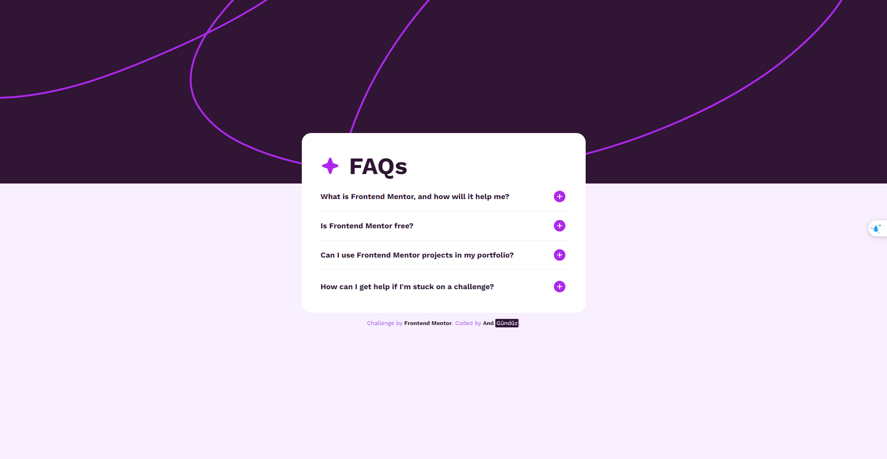
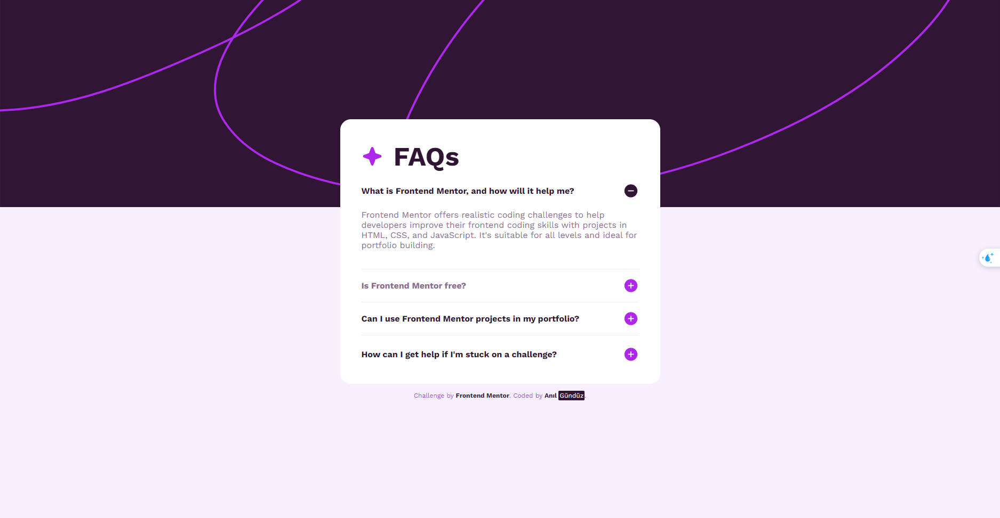
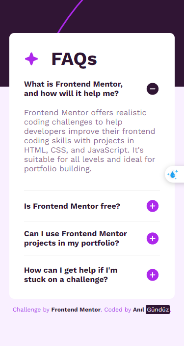

# **Frontend Mentor FAQ Accordion Challenge 🎨👩‍💻**

This repository contains a solution to the Frontend Mentor's FAQ Accordion Challenge. This challenge demonstrates how to create a modern and interactive FAQ section. The page includes a set of frequently asked questions and their answers in an accordion format.

## **Live Demo 🌐**

You can view the live demo of my project [here](https://65875ee1caaaa7cb1cca904f--grand-axolotl-cdf8ce.netlify.app/).

## **Screenshots 📸**

Below are the screenshots of my project:







## **Features ✨**

- Dynamic FAQ accordion layout.
- Interactive content hiding and showing with JavaScript.
- Neat and user-friendly interface styled with CSS.

## **Technologies Used 💻**

- HTML
- CSS
- JavaScript

## **Installation 🛠️**

To run this project locally:

1. Clone the repository:

    ```
    git clone https://github.com/agunduuz/Frontend-Mentor.git
    ```

2. Navigate to the cloned directory:

    ```
    cd Frontend-Mentor
    ```

3. Run the project on a web server or simply open the **`index.html`** file in a web browser.

## **Contributing 🤝**

If you would like to contribute to this project, please follow these steps:

1. Fork the project.
2. Create a feature branch (**`git checkout -b feature/AmazingFeature`**).
3. Commit your changes (**`git commit -m 'Add some AmazingFeature'`**).
4. Push to the branch (**`git push origin feature/AmazingFeature`**).
5. Create a Pull Request.

## **License 📄**

This project is licensed under the MIT License.
